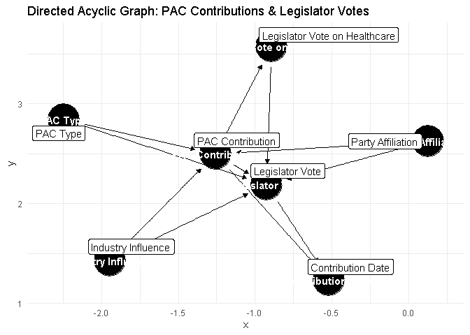

Directed Acyclic Graph (DAG) Analysis: PAC Contributions and Legislator
Votes
================
Your Name
2025-02-27

\# **Introduction**

This document presents a **Directed Acyclic Graph (DAG)** representation
of the relationship between **PAC contributions** and **legislator
votes** during the 2016 election cycle. We identify key **confounders,
mediators, and colliders**, determine the **minimal adjustment set**,
and describe how the adjustment variables will be operationalized.

------------------------------------------------------------------------

# **Theorized Population Regression Model**

The goal is to estimate the causal effect of **PAC contributions** on
**legislator votes** while controlling for necessary confounders. Below
are the key variables in the model:

- **Dependent Variable (DV):** Legislator’s Vote on Tax Policy *(Binary:
  Yea/Nay)*
- **Independent Variable (IV):** PAC Contribution Amount *(Continuous)*
- **Confounders:** Legislator Party, Industry Influence
- **Mediators:** Legislator Ideology
- **Colliders:** Lobbying Pressure, Political Popularity

------------------------------------------------------------------------

# **DAG Representation**

We construct the **DAG** using the `dagitty` package in R.

Step 2: Revisiting our Data This dataset contains:

$$
\begin{aligned}
\text{Party Affiliation} &\to \text{PAC Contribution} \to \text{Legislator Vote} \\
\text{Industry Influence} &\to \text{PAC Contribution} \to \text{Legislator Vote} \\
\text{PAC Type} &\to \text{PAC Contribution} \to \text{Legislator Vote} \\
\text{PAC Contribution} &\to \text{Legislator Vote on Healthcare} \to \text{Legislator Vote} \\
\text{PAC Contribution} &\to \text{Contribution Date} \leftarrow \text{Legislator Vote} \\
\end{aligned}
$$

Where: - **Confounders:** Party Affiliation, Industry Influence -
**Mediators:** Vote on Healthcare, PAC Type - **Collider:** Contribution
Date

``` r
dag <- dagitty('
dag {
  "PAC Contribution" -> "Legislator Vote"
  "Party Affiliation" -> "PAC Contribution"
  "Party Affiliation" -> "Legislator Vote"
  "Industry Influence" -> "PAC Contribution"
  "Industry Influence" -> "Legislator Vote"
  "PAC Type" -> "PAC Contribution"
  "PAC Type" -> "Legislator Vote"
  "PAC Contribution" -> "Legislator Vote on Healthcare"
  "Legislator Vote on Healthcare" -> "Legislator Vote"
  "PAC Contribution" -> "Contribution Date"
  "Legislator Vote" -> "Contribution Date"
}
')

# Plot DAG
ggdag(dag, text = TRUE, use_labels = "name") + 
  theme_minimal() + 
  ggtitle("Directed Acyclic Graph: PAC Contributions & Legislator Votes")
```

<!-- -->

``` r
adjustment_set <- adjustmentSets(dag, exposure = "PAC Contribution", outcome = "Legislator Vote")
adjustment_set
```

    ## { Industry Influence, PAC Type, Party Affiliation }

$$
\begin{aligned}
\text{Party Affiliation} &\to \text{PAC Contribution} \to \text{Legislator Vote} \\
\text{Industry Influence} &\to \text{PAC Contribution} \to \text{Legislator Vote} \\
\text{PAC Type} &\to \text{PAC Contribution} \to \text{Legislator Vote} \\
\text{PAC Contribution} &\to \text{Legislator Vote on Healthcare} \to \text{Legislator Vote} \\
\text{PAC Contribution} &\to \text{Contribution Date} \leftarrow \text{Legislator Vote} \\
\end{aligned}
$$

Where: - \*\*Confounders:\*\* Party Affiliation, Industry Influence -
\*\*Mediators:\*\* Vote on Healthcare, PAC Type - \*\*Collider:\*\*
Contribution Date

# **Final Regression Model with Adjustments**

The final regression equation after adjusting for confounders is:

$$
\text{Legislator Vote} = \beta_0 + \beta_1 \text{PAC Contribution} + \beta_2 \text{Party Affiliation} + \beta_3 \text{Industry Influence} + \epsilon
$$

Where:

- $\beta_1$ represents the effect of **PAC contributions** on the
  legislator’s vote.
- $\beta_2, \beta_3$ adjust for confounders (**party affiliation** and
  **industry influence**).
- $\epsilon$ is the **error term**.

This ensures that our estimated effect of **PAC contributions on votes**
is not biased by omitted confounders.

------------------------------------------------------------------------

# **Conclusion**

This **DAG-based causal model** allows us to properly control for
confounding and avoid bias from mediators or colliders. By adjusting for
**party affiliation** and **industry influence**, we ensure that our
regression estimates reflect the true **causal effect** of PAC
contributions on legislative votes.

# **Literature Review**

Understanding the relationship between PAC contributions and legislative
decision-making requires engaging with theories of interest group
influence, political networks, and policy formation. While a wealth of
literature exists on special interest groups, lobbying, and the policy
process, existing research often focuses on aggregate influence rather
than the mechanisms through which financial contributions shape
legislative outcomes. This paper argues that PAC contributions function
as an informational and strategic signaling mechanism within a
structured policy community system (PCS). By examining this dynamic
within a network-based decision-making model, this study fills a gap in
the literature, providing a cybernetic and system-theoretic
understanding of how contributions function as communicative
interventions in the legislative process.

## **Special Interest Groups & Political Networks**

### **Special Interest Groups and Influence Mechanisms**

The influence of special interest groups in American politics is
well-documented, yet the exact pathways through which financial
contributions translate into policy influence remain contested.
Traditional economic models (Ainsworth & Sened, 1993) argue that
interest group entrepreneurs (IGE) serve two audiences: the lawmakers
they lobby and the group members they represent. From this perspective,
financial contributions primarily provide informational benefits,
reducing uncertainty in policymaker decision-making.

However, empirical research by Gilens & Page (2014) challenges this
assumption by demonstrating that economic elites and organized groups
significantly outweigh public preferences in shaping policy. Their
findings indicate that average citizens have minimal influence on policy
outcomes, suggesting that financial contributions serve not merely an
informational function but a structural one, locking in elite
preferences within the policy network.

Other scholars highlight the signaling power of financial contributions.
Lohmann (1993) presents a game-theoretic model in which interest groups
strategically use financial contributions to send informative and
manipulative signals to legislators. Similarly, Kalla & Broockman (2016)
demonstrate that campaign contributions increase access to legislators,
reinforcing the idea that moneyed interests act as anticipatory signals
for future engagement. These findings support the argument that PAC
contributions operate as a strategic form of network reinforcement,
guiding legislators toward preference alignment with donors.

The revolving door lobbying phenomenon (LaPira & Thomas III, 2017)
further exemplifies how financial contributions reinforce institutional
power structures. Scholars such as Stigler (1971) and Li (2018) argue
that regulatory capture and access-seeking PACs illustrate the
self-reinforcing nature of financial power. Rather than operating in an
idealized competitive market of ideas, interest group politics form
dense, self-reinforcing networks where previous political elites cycle
into private lobbying roles, perpetuating policy inertia.

### **Political Networks & the Policy Community System**

Building on this, political networks provide the structural foundation
for understanding PAC influence. Austen-Smith & Wright (1994a) introduce
the concept of counteractive lobbying, where interest groups
strategically balance competing political forces to shape policy
outcomes. This aligns with Becker’s (1985) pressure system model,
suggesting that PAC contributions function as a stabilizing force in the
policy network, maintaining political equilibrium rather than
introducing substantive change.

Using Luhmannian and Parsonian system theory, we argue that PAC
contributions serve as communicative interventions within the Policy
Community System (PCS). Heaney & Strickland (2016) demonstrate that
interest group coalitions function as complex adaptive systems,
reinforcing network ties through repeated interactions. From a
Luhmannian perspective, this suggests that PAC contributions do not
merely influence legislators as individual decision-makers but rather
reinforce the operational closure of the policy community as a whole.

Scholarship on networked lobbying strategies (Victor & Koger, 2016;
Box-Steffensmeier et al., 2019) further supports this argument.
Political networks do not operate randomly; rather, interest groups
systematically forge relationships through contributions,
coalition-building, and access-seeking strategies. Furnas et al. (2019)
and Heaney & Leifeld (2018) demonstrate that partisan lobbying firms
specialize in forging stable policy alignments, solidifying their
influence not through single transactions but through long-term
relational exchanges.

Taken together, this literature suggests that financial contributions
should not be understood as a simple “quid pro quo” transaction but
rather as a network-based, systemic reinforcement mechanism. While
traditional research has analyzed interest groups as individual actors,
this paper advances a cybernetic model in which PAC contributions serve
as recursive signals within the broader PCS, reinforcing specific
ideological and policy preferences over time.

## **Communication & Information in the Policy System**

Communication and information exchange are central to the legitimization
of financial contributions in politics. Traditional public choice models
assume that interest groups provide information to legislators as a
public good (Austen-Smith, 1993). However, Ban et al. (2023) demonstrate
that information flow is asymmetrical, favoring groups with financial
leverage. Their research finds that witnesses in congressional hearings
are more likely to reflect the perspectives of well-funded interest
groups, reinforcing systemic biases.

Beyond direct influence, Leydesdorff (2021) and Geels (2020) explore how
network communication patterns shape decision-making. Applying Triple
Helix theory, Leydesdorff’s network analysis of
university-industry-government relations suggests that communication
dynamics determine the selection mechanisms that guide system evolution.
In a policy community system, financial contributions may serve a
similar selection function, influencing which issues become politically
salient.

From a Luhmannian perspective, PAC contributions can be understood as
structural couplings between economic and political subsystems. Just as
in Leydesdorff’s innovation systems, these financial signals do not
merely convey information but actively shape the trajectory of
legislative decision-making by determining who gets access, which
policies are prioritized, and how issues are framed.

## **Contribution to the Literature**

This paper extends the existing literature by shifting the focus from
individual transactions to systemic, networked influence. While much
research has documented the direct effects of PAC contributions on
policymaking, this study situates PAC contributions within a larger
theoretical framework of political network dynamics, cybernetic
communication, and systemic policy reinforcement.

We challenge traditional public choice models by demonstrating that
financial contributions do not merely “buy votes” but serve a signaling
and reinforcement function within policy networks. We integrate
cybernetic and system-theoretic approaches to argue that PAC
contributions serve as recursive signals that influence legislative
decision-making over time. We provide empirical justification for
understanding PAC contributions as communicative interventions that
operate within the structural coupling of the economic and political
systems. By doing so, this paper offers a novel theoretical framework
that bridges interest group influence, networked lobbying, and systemic
decision-making in the study of PAC contributions and legislative
behavior.
