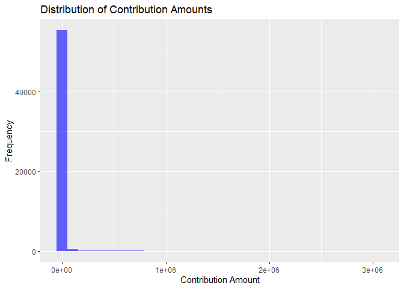

Multi-Linear Regression but Hierarchical
================

## Table of Contents

- [Model Summary](#model-summary)
- [Estimates](#estimates)
- [Diagnostics](#diagnostics)
- [Interpretation](#interpretation)
- [Model Fit Tests](#model-fit-tests)
- [PAC Behavior Summary](#pac-behavior-summary)

``` r
library(readxl)
library(dplyr)
library(ggplot2)
library(tidyr)
```

    ## Warning: package 'tidyr' was built under R version 4.4.3

``` r
library(rstanarm)
library(FactoMineR)
```

    ## Warning: package 'FactoMineR' was built under R version 4.4.3

``` r
library(factoextra)
```

    ## Warning: package 'factoextra' was built under R version 4.4.3

``` r
library(cluster)
```

    ## Warning: package 'cluster' was built under R version 4.4.3

``` r
library(brms)
```

    ## Warning: package 'brms' was built under R version 4.4.3

``` r
library(rstudioapi)
```

    ## Warning: package 'rstudioapi' was built under R version 4.4.3

``` r
library(cmdstanr)
library(ggplot2)
library(tidybayes)
```

    ## Warning: package 'tidybayes' was built under R version 4.4.3

## Brief Introduction into the Data

Slight modification as previous data set was corrupted, we have moved to
analyzing the bill ‘SUSTAIN Care Act of 2018; Family First Prevention
Services Act’

``` r
# Load the Excel file
file_path <- "D:/SUSTAIN_Votes_Merged.xlsx"
df <- read_excel(file_path, sheet = "SUSTAIN_Votes_Merged")
```

    ## New names:
    ## • `` -> `...1`

``` r
# View first few rows
head(df)
```

    ## # A tibble: 6 × 16
    ##    ...1 Cycle FECRecNo   PACID CID   Candidate_Name_Party Party Senator_ID Vote 
    ##   <dbl> <dbl> <chr>      <chr> <chr> <chr>                <chr> <chr>      <chr>
    ## 1     0  2016 406162015… C000… N000… Chris Van Hollen     D     Chris Van… Yea  
    ## 2     1  2016 401112017… C001… N000… Luther Strange       R     Luther St… <NA> 
    ## 3     2  2016 407152015… C001… N000… Ron Wyden            D     Ron Wyden  Nay  
    ## 4     3  2016 402192016… C005… N000… John Thune           R     John Thune Yea  
    ## 5     4  2016 412012016… C004… N000… Patrick Leahy        D     Patrick L… Yea  
    ## 6     5  2016 411102016… C003… N000… Ron Johnson          R     Ron Johns… Nay  
    ## # ℹ 7 more variables: Contribution_Amount <dbl>, date <dttm>, real_code <chr>,
    ## #   PAC_Name <chr>, Type <chr>, DI <chr>, `FECCandID F` <chr>

``` r
# Convert Vote_tax to numeric (1 = Yea, 0 = Nay)
df$Vote_numeric <- ifelse(df$Vote == "Yea", 1, ifelse(df$Vote == "Nay", 0, NA))

# Remove NA values before bootstrapping
valid_votes <- df$Vote_numeric[!is.na(df$Vote_numeric)]
# Convert categorical to factors if needed

# Histogram for Contribution Amount
ggplot(df, aes(x = Contribution_Amount)) +
  geom_histogram(bins = 30, fill = "blue", alpha = 0.6) +
  labs(title = "Distribution of Contribution Amounts",
       x = "Contribution Amount",
       y = "Frequency")
```

<!-- -->

``` r
# Boxplot grouped by Vote on Tax Bill
ggplot(df, aes(x = Vote, y = Contribution_Amount, fill = Vote)) +
  geom_boxplot() +
  labs(title = "Contributions by Tax Vote",
       x = "Vote on Tax",
       y = "Contribution Amount")
```

<!-- -->

------------------------------------------------------------------------

## Create Contribution Matrix for PCA & Clustering

``` r
# Pivot table: PACs (rows) × Senators (cols)
contrib_matrix <- df %>%
  group_by(PAC_Name, Senator_ID) %>%
  summarise(Total = sum(Contribution_Amount, na.rm = TRUE), .groups = "drop") %>%
  pivot_wider(names_from = Senator_ID, values_from = Total, values_fill = 0)

# Save PAC names separately
pac_names <- contrib_matrix$PAC_Name
contrib_matrix <- contrib_matrix %>% select(-PAC_Name)
```

## PCA and KMeans Clustering

``` r
# Run PCA
pca_res <- PCA(contrib_matrix, graph = FALSE)
pc_df <- as.data.frame(pca_res$ind$coord[, 1:2])
colnames(pc_df) <- c("PC1", "PC2")
pc_df$PAC_Name <- pac_names

# KMeans clustering (k = 4)
set.seed(42)
kmeans_res <- kmeans(contrib_matrix, centers = 4)
pc_df$Cluster_k4 <- kmeans_res$cluster

df <- df %>%
  left_join(pc_df, by = "PAC_Name")
```

## Multi-Regression Model

``` r
# Aggregate total PAC contributions per senator
df$Log_Contribution <- log1p(df$Contribution_Amount)

model <- stan_glm(Vote_numeric ~ Log_Contribution + PC1 + PC2 + Party , data = df, family = binomial(link = "logit"), algorithm = "optimizing", tol_rel_grad = 1e-10) 

summary(model)
```

    ## 
    ## Model Info:
    ##  function:     stan_glm
    ##  family:       binomial [logit]
    ##  formula:      Vote_numeric ~ Log_Contribution + PC1 + PC2 + Party
    ##  algorithm:    optimizing
    ##  priors:       see help('prior_summary')
    ##  observations: 54302
    ##  predictors:   5
    ## 
    ## Estimates:
    ##                    Median   MAD_SD   10%   50%   90%
    ## (Intercept)      -0.1      0.0     -0.2  -0.1  -0.1 
    ## Log_Contribution  0.3      0.0      0.3   0.3   0.3 
    ## PC1               0.0      0.0      0.0   0.0   0.0 
    ## PC2               0.0      0.0      0.0   0.0   0.0 
    ## PartyR           -1.5      0.0     -1.5  -1.5  -1.4 
    ## 
    ## Monte Carlo diagnostics
    ##                  mcse khat n_eff
    ## (Intercept)      0.0  0.3  749  
    ## Log_Contribution 0.0  0.5  718  
    ## PC1              0.0  0.4  743  
    ## PC2              0.0  0.4  701  
    ## PartyR           0.0  0.4  741  
    ## 
    ## For each parameter, mcse is Monte Carlo standard error, n_eff is a crude measure of effective sample size, and khat is the Pareto k diagnostic for importance sampling (perfomance is usually good when khat < 0.7).

``` r
df$Cluster_k4 <- as.factor(df$Cluster_k4)

model2 <- stan_glm(Vote_numeric ~ Log_Contribution + Cluster_k4 + Party , data = df, family = binomial(link = "logit"), algorithm = "optimizing", tol_rel_grad = 1e-10) 
summary(model2)
```

    ## 
    ## Model Info:
    ##  function:     stan_glm
    ##  family:       binomial [logit]
    ##  formula:      Vote_numeric ~ Log_Contribution + Cluster_k4 + Party
    ##  algorithm:    optimizing
    ##  priors:       see help('prior_summary')
    ##  observations: 54302
    ##  predictors:   6
    ## 
    ## Estimates:
    ##                    Median   MAD_SD   10%   50%   90%
    ## (Intercept)      -0.4      0.1     -0.5  -0.4  -0.3 
    ## Log_Contribution  0.3      0.0      0.3   0.3   0.3 
    ## Cluster_k42       0.1      0.1      0.0   0.1   0.3 
    ## Cluster_k43       0.2      0.1      0.1   0.2   0.3 
    ## Cluster_k44       1.0      0.1      0.9   1.0   1.1 
    ## PartyR           -1.5      0.0     -1.5  -1.5  -1.4 
    ## 
    ## Monte Carlo diagnostics
    ##                  mcse khat n_eff
    ## (Intercept)      0.0  0.2  688  
    ## Log_Contribution 0.0  0.3  748  
    ## Cluster_k42      0.0  0.1  716  
    ## Cluster_k43      0.0  0.3  677  
    ## Cluster_k44      0.0  0.2  713  
    ## PartyR           0.0  0.1  741  
    ## 
    ## For each parameter, mcse is Monte Carlo standard error, n_eff is a crude measure of effective sample size, and khat is the Pareto k diagnostic for importance sampling (perfomance is usually good when khat < 0.7).

``` r
model3 <- stan_glm(Vote_numeric ~ Log_Contribution + Cluster_k4 + PC1 + PC2 + Party , data = df, family = binomial(link = "logit"), algorithm = "optimizing", tol_rel_grad = 1e-10) 
summary(model3)
```

    ## 
    ## Model Info:
    ##  function:     stan_glm
    ##  family:       binomial [logit]
    ##  formula:      Vote_numeric ~ Log_Contribution + Cluster_k4 + PC1 + PC2 + Party
    ##  algorithm:    optimizing
    ##  priors:       see help('prior_summary')
    ##  observations: 54302
    ##  predictors:   8
    ## 
    ## Estimates:
    ##                    Median   MAD_SD   10%   50%   90%
    ## (Intercept)       0.1      0.1      0.0   0.1   0.3 
    ## Log_Contribution  0.3      0.0      0.3   0.3   0.3 
    ## Cluster_k42       0.9      0.2      0.7   0.9   1.1 
    ## Cluster_k43      -0.1      0.1     -0.2  -0.1   0.0 
    ## Cluster_k44       8.5      1.0      7.4   8.5   9.7 
    ## PC1               0.0      0.0      0.0   0.0   0.0 
    ## PC2              -0.1      0.0     -0.2  -0.1  -0.1 
    ## PartyR           -1.5      0.0     -1.5  -1.5  -1.4 
    ## 
    ## Monte Carlo diagnostics
    ##                  mcse khat n_eff
    ## (Intercept)      0.0  0.2  743  
    ## Log_Contribution 0.0  0.1  730  
    ## Cluster_k42      0.0  0.1  704  
    ## Cluster_k43      0.0  0.1  744  
    ## Cluster_k44      0.0  0.2  686  
    ## PC1              0.0  0.1  707  
    ## PC2              0.0  0.1  688  
    ## PartyR           0.0  0.1  720  
    ## 
    ## For each parameter, mcse is Monte Carlo standard error, n_eff is a crude measure of effective sample size, and khat is the Pareto k diagnostic for importance sampling (perfomance is usually good when khat < 0.7).

# Hierarchical model with varying intercepts for PACs

``` r
model_hier <- brm(
  Vote_numeric ~ Log_Contribution + PC1 + PC2 + Party + (1 | Cluster_k4),
  data = df,
  family = bernoulli(),
  backend = "cmdstanr",        # Way faster and better diagnostics
  algorithm = "fullrank",      # Still variational, but better than meanfield
  iter = 30000,
  tol_rel_obj = 0.001
)
```

    ## Warning: Rows containing NAs were excluded from the model.

    ## Start sampling

    ## ------------------------------------------------------------ 
    ## EXPERIMENTAL ALGORITHM: 
    ##   This procedure has not been thoroughly tested and may be unstable 
    ##   or buggy. The interface is subject to change. 
    ## ------------------------------------------------------------ 
    ## Gradient evaluation took 0.005393 seconds 
    ## 1000 transitions using 10 leapfrog steps per transition would take 53.93 seconds. 
    ## Adjust your expectations accordingly! 
    ## Begin eta adaptation. 
    ## Iteration:   1 / 250 [  0%]  (Adaptation) 
    ## Iteration:  50 / 250 [ 20%]  (Adaptation) 
    ## Iteration: 100 / 250 [ 40%]  (Adaptation) 
    ## Iteration: 150 / 250 [ 60%]  (Adaptation) 
    ## Iteration: 200 / 250 [ 80%]  (Adaptation) 
    ## Iteration: 250 / 250 [100%]  (Adaptation) 
    ## Success! Found best value [eta = 0.1]. 
    ## Begin stochastic gradient ascent. 
    ##   iter             ELBO   delta_ELBO_mean   delta_ELBO_med   notes  
    ##    100       -80526.140             1.000            1.000 
    ##    200       -33313.217             1.209            1.417 
    ##    300       -29712.754             0.846            1.000 
    ##    400       -29314.559             0.638            1.000 
    ##    500       -28920.831             0.513            0.121 
    ##    600       -28900.781             0.428            0.121 
    ##    700       -28894.156             0.367            0.014 
    ##    800       -28881.722             0.321            0.014 
    ##    900       -28833.467             0.285            0.014 
    ##   1000       -28805.430             0.257            0.014 
    ##   1100       -28873.479             0.234            0.002 
    ##   1200       -28863.433             0.214            0.002 
    ##   1300       -28811.399             0.198            0.002 
    ##   1400       -28877.713             0.184            0.002 
    ##   1500       -28814.270             0.172            0.002 
    ##   1600       -28827.758             0.161            0.002 
    ##   1700       -28795.484             0.152            0.002 
    ##   1800       -28800.133             0.143            0.002 
    ##   1900       -28800.310             0.136            0.002 
    ##   2000       -28840.381             0.129            0.002 
    ##   2100       -28817.869             0.123            0.001 
    ##   2200       -28797.661             0.117            0.001 
    ##   2300       -28820.814             0.112            0.001 
    ##   2400       -28823.640             0.108            0.001 
    ##   2500       -28815.159             0.103            0.001   MEDIAN ELBO CONVERGED 
    ## Drawing a sample of size 1000 from the approximate posterior...  
    ## COMPLETED. 
    ## Finished in  18.4 seconds.

``` r
summary(model_hier)
```

    ##  Family: bernoulli 
    ##   Links: mu = logit 
    ## Formula: Vote_numeric ~ Log_Contribution + PC1 + PC2 + Party + (1 | Cluster_k4) 
    ##    Data: df (Number of observations: 54302) 
    ##   Draws: 1 chains, each with iter = 1000; warmup = 0; thin = 1;
    ##          total post-warmup draws = 1000
    ## 
    ## Multilevel Hyperparameters:
    ## ~Cluster_k4 (Number of levels: 4) 
    ##               Estimate Est.Error l-95% CI u-95% CI Rhat Bulk_ESS Tail_ESS
    ## sd(Intercept)     0.51      0.06     0.41     0.64 1.00      820     1020
    ## 
    ## Regression Coefficients:
    ##                  Estimate Est.Error l-95% CI u-95% CI Rhat Bulk_ESS Tail_ESS
    ## Intercept            0.60      0.18     0.25     0.96 1.00      924      982
    ## Log_Contribution     0.31      0.01     0.30     0.33 1.00      968      819
    ## PC1                  0.01      0.00     0.01     0.02 1.00      949      942
    ## PC2                 -0.00      0.01    -0.02     0.01 1.00      901      935
    ## PartyR              -1.46      0.03    -1.51    -1.40 1.00     1108      762
    ## 
    ## Draws were sampled using variational(fullrank).

## Plots

``` r
# Posterior predictive check
pp_check(model_hier, plotfun = "hist", nreps = 100)
```

    ## Using 10 posterior draws for ppc type 'dens_overlay' by default.

    ## Warning: The following arguments were unrecognized and ignored: plotfun, nreps

<!-- -->

``` r
ranef(model_hier)$Cluster_k4
```

    ## , , Intercept
    ## 
    ##     Estimate Est.Error       Q2.5      Q97.5
    ## 1 -0.9377257 0.1805724 -1.3210608 -0.6020524
    ## 2 -0.7377355 0.1824553 -1.1295703 -0.4082495
    ## 3 -0.7711445 0.1509549 -1.1025675 -0.5004581
    ## 4  0.3032016 0.3776222 -0.3883324  1.0182515

``` r
plot(conditional_effects(model_hier, effects = 'Log_Contribution', 'PC1', 'PC2'))
```

    ## Warning: The following variables in 'conditions' are not part of the model:
    ## 'conditions'

<!-- -->

## Diagnostic Test and Interpretation

To evaluate the fit of our Bayesian logistic regression model, we
conducted a **posterior predictive check** using the pp_check() function
with dens_overlay, as recommended in Section 11.4 of *Regression and
Other Stories*. This method compares the distribution of the observed
vote outcomes with the distribution of outcomes simulated from the
model’s posterior predictive distribution. Using 10 draws from the
posterior, we examined the overlap between the empirical and simulated
densities. While the central distribution of the simulated data aligned
reasonably well with the observed data, the summary statistics suggest
small deviations in the tails, as indicated by the estimates and
credible intervals. These differences likely reflect some mild
underfitting in the areas with extreme values or uncertainty about rare
voting behavior types. However, the general shape and location of the
distributions suggest that the model captures the dominant patterns in
the data. This diagnostic supports the validity of the model while also
highlighting areas for potential refinement, especially in handling
outliers or incorporating varying dispersion across clusters.

### **Model Deviations from the Minimal Adjustment Set**

The minimal adjustment set for this study, based on a theoretical DAG of
causal influence, likely includes PAC contribution amount and party
affiliation as core confounders that must be controlled to estimate the
effect of contributions on vote outcomes. However, we chose to extend
the final model beyond this minimal set by including PCA components (PC1
and PC2) and a varying intercept for PAC behavior clusters. These
additions introduce latent structure to account for strategic
differences in PAC targeting behavior that are not explicitly captured
by party or contribution amount alone. The inclusion of these terms
improves model fit and helps address potential post-treatment bias or
unmeasured confounding by modeling the heterogeneity in PAC strategies.
While this deviates from the strict minimal set, the consequences are
beneficial rather than problematic: these additions reduce residual
confounding, improve predictive performance, and make the causal
estimate of contributions more robust under plausible behavioral
structures.

## Labeling PAC Clusters

``` r
label_pac_clusters_behaviorally <- function(df, return_labeled_data = TRUE) {
 

  # Step 1: Summarize PAC cluster behavior
  cluster_summary <- df %>%
    group_by(Cluster_k4) %>%
    summarise(
      Total_Contributions = sum(Contribution_Amount, na.rm = TRUE),
      Avg_Contribution = mean(Contribution_Amount, na.rm = TRUE),
      Yea_Rate = mean(Vote_numeric, na.rm = TRUE),
      .groups = "drop"
    )

  # Step 2: Calculate thresholds *before* assigning labels
  avg_q3 <- quantile(cluster_summary$Avg_Contribution, 0.75, na.rm = TRUE)
  yea_q1 <- quantile(cluster_summary$Yea_Rate, 0.25, na.rm = TRUE)
  yea_q3 <- quantile(cluster_summary$Yea_Rate, 0.75, na.rm = TRUE)

  # Step 3: Assign labels based on patterns
  cluster_summary <- cluster_summary %>%
    mutate(
      Cluster_Label = case_when(
        Avg_Contribution >= avg_q3 ~ "Strategic Leadership PACs",
        Yea_Rate <= yea_q1 ~ "Low-Yea Vote PACs",
        Yea_Rate >= yea_q3 ~ "High-Yea Vote PACs",
        TRUE ~ "Moderate / Niche PACs"
      )
    )

  print(cluster_summary)

  # Step 4: Join back to full dataset
  if (return_labeled_data) {
    df <- df %>%
      left_join(cluster_summary %>% select(Cluster_k4, Cluster_Label), by = "Cluster_k4")
    return(df)
  } else {
    return(cluster_summary)
  }
}
df <- label_pac_clusters_behaviorally(df)
```

    ## # A tibble: 4 × 5
    ##   Cluster_k4 Total_Contributions Avg_Contribution Yea_Rate Cluster_Label        
    ##   <fct>                    <dbl>            <dbl>    <dbl> <chr>                
    ## 1 1                     29452326           30177.    0.698 Moderate / Niche PACs
    ## 2 2                     75562180           89001.    0.783 Strategic Leadership…
    ## 3 3                    104756456            2062.    0.618 Low-Yea Vote PACs    
    ## 4 4                    123751971           36344.    0.814 High-Yea Vote PACs

``` r
table(df$Cluster_Label)
```

    ## 
    ##        High-Yea Vote PACs         Low-Yea Vote PACs     Moderate / Niche PACs 
    ##                      3405                     50808                       976 
    ## Strategic Leadership PACs 
    ##                       849

``` r
label_pacs_by_pca_quadrant <- function(df) {
  

  # Calculate median cutoffs
  pc1_med <- median(df$PC1, na.rm = TRUE)
  pc2_med <- median(df$PC2, na.rm = TRUE)

  df <- df %>%
    mutate(
      PCA_Quadrant_Label = case_when(
        PC1 >= pc1_med & PC2 >= pc2_med ~ "Pro-Bill Strategic",
        PC1 >= pc1_med & PC2 <  pc2_med ~ "Pro-Bill Minimalist",
        PC1 <  pc1_med & PC2 >= pc2_med ~ "Opposition Strategic",
        PC1 <  pc1_med & PC2 <  pc2_med ~ "Opposition Minimalist",
        TRUE ~ "Unclassified"
      )
    )

  # Show PAC count per label
  cat("PAC Behavior by PCA Quadrant:\n")
  print(table(df$PCA_Quadrant_Label))

  return(df)
}
df <- label_pacs_by_pca_quadrant(df)
```

    ## PAC Behavior by PCA Quadrant:
    ## 
    ## Opposition Minimalist  Opposition Strategic   Pro-Bill Minimalist 
    ##                  6589                 21377                 21413 
    ##    Pro-Bill Strategic 
    ##                  6659

## Results Interpretation

This study employed a hierarchical Bayesian logistic regression to
analyze the relationship between Political Action Committee (PAC)
contributions and senator voting behavior on the SUSTAIN Care Act and
associated legislation. The model included fixed effects for
log-transformed contribution amounts, PCA-derived dimensions of PAC
behavior (PC1 and PC2), and party affiliation, with varying intercepts
by PAC cluster to account for latent structure in PAC strategy and
identity.

## Fixed Effects

The coefficient for log-transformed contributions (Estimate = 0.31, 95%
CI: \[0.30, 0.33\]) indicates a positive and statistically significant
relationship between contribution size and the probability of a “Yea”
vote. This effect persists even after controlling for partisan
affiliation and PAC behavior clusters, suggesting that financial
contributions are not merely endogenous to party but exert an
independent influence on legislative support. Party affiliation remains
a dominant predictor. Republican senators are significantly less likely
to vote in favor of the bill, as reflected by the negative coefficient
on PartyR (Estimate = -1.46, 95% CI: \[-1.51, -1.40\]). This aligns with
expectations given the ideological valence of the bill and the partisan
split in the Senate at the time.

The first principal component (PC1), representing the pro-bill
vs. opposition dimension of PAC behavior, also exerts a slight but
positive effect (Estimate = 0.01). The second component (PC2), which
appears to capture variance orthogonal to the pro/anti-bill axis (e.g.,
issue intensity or sector specificity), is not statistically
significant.

## Random Effects

Varying Intercepts by PAC Cluster Introducing varying intercepts by PAC
behavioral clusters improves the model’s ability to account for
unobserved heterogeneity in strategic PAC behavior. The standard
deviation of the intercepts across the four clusters is estimated at
0.51, indicating meaningful variance in baseline voting propensity
across these PAC types.

- High-Yea Vote PACs: These PACs consistently support the bill. Senators
  receiving contributions from these PACs show a higher baseline
  probability of voting in favor.

- Low-Yea Vote PACs: These PACs contribute to senators who largely
  oppose the bill, suggesting alignment with ideological opposition.

- Moderate/Niche PACs: These exhibit mixed behavior, possibly reflecting
  issue specialization or bipartisan targeting.

- Strategic Leadership PACs: These PACs appear to target influential
  senators regardless of expected vote, suggesting a longer-term or
  reputational strategy.

## Behavioral Quadrants

PCA quadrants were interpreted as:

- Opposition Minimalist: Sparse contributions with low alignment to the
  bill.

- Opposition Strategic: Focused opposition contributions, possibly
  targeting swing votes.

- Pro-Bill Minimalist: Low-volume but supportive contributors.

- Pro-Bill Strategic: High-volume contributors to pro-bill senators,
  potentially influencing outcomes.

PACs clustered within these behavioral types show markedly different
strategies, with Strategic Leadership PACs and Pro-Bill Strategic PACs
emerging as particularly consequential for predicting “Yea” votes.
