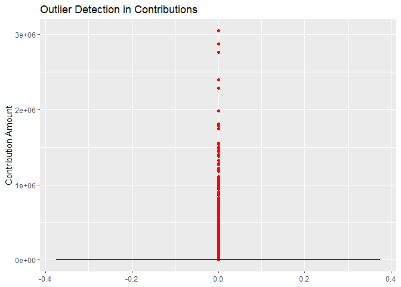
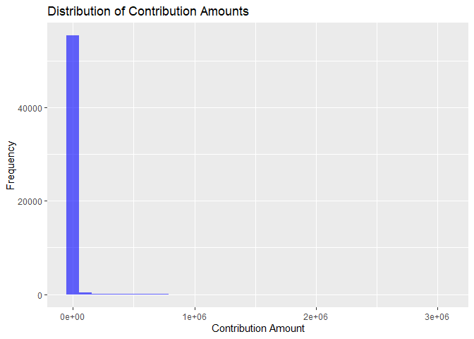
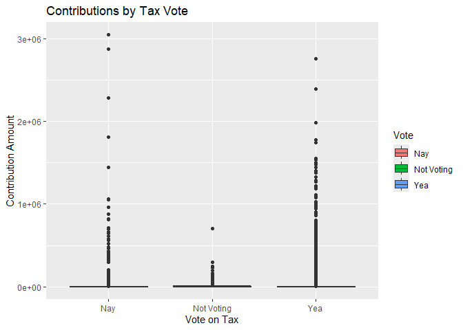
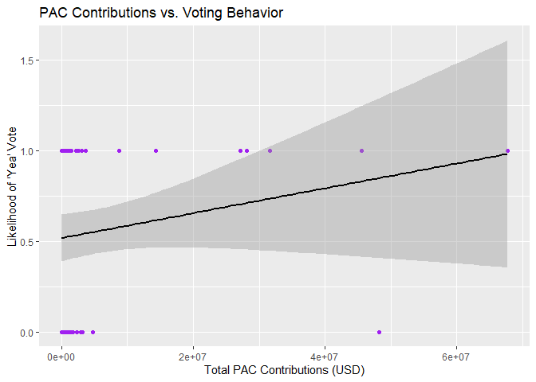
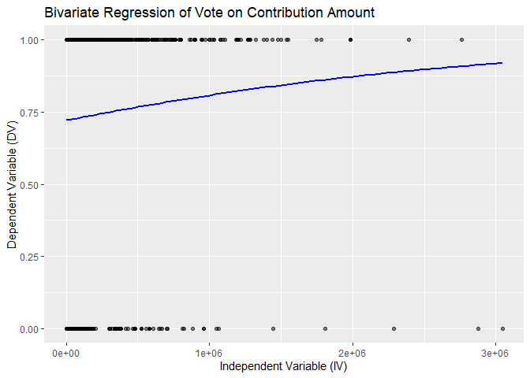
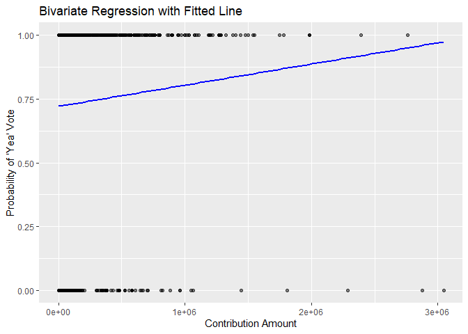

Linear Regression
================
Joe Fowler III

## 1. Introduction

This analysis aims to estimate a bivariate linear regression model using
Bayesian regression with `stan_glm(...)`. We will: - Prepare the dataset
by subsetting if necessary. - Convert or subset the dependent variable
(DV) to ensure it is binary. - Estimate a regression model without
control variables. - Visualize the results with a scatterplot and fitted
regression line. - Compute and interpret the R² value.

``` r
library(readxl)
library(dplyr)
```

    ## 
    ## Attaching package: 'dplyr'

    ## The following objects are masked from 'package:stats':
    ## 
    ##     filter, lag

    ## The following objects are masked from 'package:base':
    ## 
    ##     intersect, setdiff, setequal, union

``` r
library(ggplot2)
library(rstanarm)
```

    ## Loading required package: Rcpp

    ## This is rstanarm version 2.32.1

    ## - See https://mc-stan.org/rstanarm/articles/priors for changes to default priors!

    ## - Default priors may change, so it's safest to specify priors, even if equivalent to the defaults.

    ## - For execution on a local, multicore CPU with excess RAM we recommend calling

    ##   options(mc.cores = parallel::detectCores())

## Load the Data in R

Use the readxl package to read the Excel file.

``` r
# Load the Excel file
file_path <- "D:/10192024_Vote_Bill_pos_contr.xlsx"
df <- read_excel(file_path, sheet = "Sheet1")

# View first few rows
head(df)
```

    ## # A tibble: 6 × 15
    ##   Cycle FECRecNo PACID     CID       Candidate_Name_Party Party Senator_ID Vote 
    ##   <dbl>    <dbl> <chr>     <chr>     <chr>                <chr> <chr>      <chr>
    ## 1  2016  4.06e18 C00007880 N00013820 Chris Van Hollen     D     Chris Van… Nay  
    ## 2  2016  4.01e18 C00167460 N00040607 Luther Strange       R     Luther St… Yea  
    ## 3  2016  4.07e18 C00174367 N00007724 Ron Wyden            D     Ron Wyden  Nay  
    ## 4  2016  4.02e18 C00521328 N00004572 John Thune           R     John Thune Yea  
    ## 5  2016  4.12e18 C00451153 N00009918 Patrick Leahy        D     Patrick L… Nay  
    ## 6  2016  4.11e18 C00354290 N00032546 Ron Johnson          R     Ron Johns… Yea  
    ## # ℹ 7 more variables: Contribution_Amount <dbl>, date <dttm>, real_code <chr>,
    ## #   PAC_Name <chr>, Type <chr>, DI <chr>, `FECCandID F` <chr>

## Check the Structure of Data

You can also embed plots, for example:

``` r
# Check structure of dataset
str(df)
```

    ## tibble [56,038 × 15] (S3: tbl_df/tbl/data.frame)
    ##  $ Cycle               : num [1:56038] 2016 2016 2016 2016 2016 ...
    ##  $ FECRecNo            : num [1:56038] 4.06e+18 4.01e+18 4.07e+18 4.02e+18 4.12e+18 ...
    ##  $ PACID               : chr [1:56038] "C00007880" "C00167460" "C00174367" "C00521328" ...
    ##  $ CID                 : chr [1:56038] "N00013820" "N00040607" "N00007724" "N00004572" ...
    ##  $ Candidate_Name_Party: chr [1:56038] "Chris Van Hollen" "Luther Strange" "Ron Wyden" "John Thune" ...
    ##  $ Party               : chr [1:56038] "D" "R" "D" "R" ...
    ##  $ Senator_ID          : chr [1:56038] "Chris Van Hollen" "Luther Strange" "Ron Wyden" "John Thune" ...
    ##  $ Vote                : chr [1:56038] "Nay" "Yea" "Nay" "Yea" ...
    ##  $ Contribution_Amount : num [1:56038] 1000 5000 500 2500 1000 1000 2500 1000 1000 1000 ...
    ##  $ date                : POSIXct[1:56038], format: "2015-03-06" "2016-12-13" ...
    ##  $ real_code           : chr [1:56038] "F1300" "F3300" "E1140" "G5280" ...
    ##  $ PAC_Name            : chr [1:56038] "Liquor wholesalers" "Natural Gas transmission & distribution" "Trial lawyers & law firms" "Freight & delivery services" ...
    ##  $ Type                : chr [1:56038] "24K" "24K" "24K" "24K" ...
    ##  $ DI                  : chr [1:56038] "D" "D" "D" "D" ...
    ##  $ FECCandID F         : chr [1:56038] "H2MD08126" "S8AL00308" "S6OR00110" "S2SD00068" ...

``` r
# View column names
colnames(df)
```

    ##  [1] "Cycle"                "FECRecNo"             "PACID"               
    ##  [4] "CID"                  "Candidate_Name_Party" "Party"               
    ##  [7] "Senator_ID"           "Vote"                 "Contribution_Amount" 
    ## [10] "date"                 "real_code"            "PAC_Name"            
    ## [13] "Type"                 "DI"                   "FECCandID F"

## Outlier Detection in Contribution Amount

You can also embed plots, for example:

``` r
# Boxplot for Contribution_Amount
ggplot(df, aes(y = Contribution_Amount)) +
  geom_boxplot(outlier.colour = "red", outlier.shape = 16) +
  labs(title = "Outlier Detection in Contributions",
       y = "Contribution Amount")
```

<!-- -->

``` r
# Find high-value outliers
outliers <- df %>% filter(Contribution_Amount > quantile(Contribution_Amount, 0.99))
print(outliers)
```

    ## # A tibble: 561 × 15
    ##    Cycle FECRecNo PACID     CID      Candidate_Name_Party Party Senator_ID Vote 
    ##    <dbl>    <dbl> <chr>     <chr>    <chr>                <chr> <chr>      <chr>
    ##  1  2016  4.10e18 C90005786 N000371… Catherine Cortez Ma… D     Catherine… Nay  
    ##  2  2016  2.04e18 C00492785 N000330… Ted Cruz             R     Ted Cruz   Yea  
    ##  3  2016  2.08e18 C00496075 N000308… Rand Paul            R     Rand Paul  Yea  
    ##  4  2016  2.11e18 C00476374 N000306… Todd Young           R     Todd Young Yea  
    ##  5  2016  4.10e18 C90013145 N000064… John McCain          R     John McCa… Not …
    ##  6  2016  4.07e18 C00525899 N000308… Rand Paul            R     Rand Paul  Yea  
    ##  7  2016  4.04e18 C00592337 N000330… Ted Cruz             R     Ted Cruz   Yea  
    ##  8  2016  4.12e18 C00573733 N000099… Lindsey Graham       R     Lindsey G… Yea  
    ##  9  2016  4.12e18 C00573733 N000099… Lindsey Graham       R     Lindsey G… Yea  
    ## 10  2016  4.12e18 C00573733 N000099… Lindsey Graham       R     Lindsey G… Yea  
    ## # ℹ 551 more rows
    ## # ℹ 7 more variables: Contribution_Amount <dbl>, date <dttm>, real_code <chr>,
    ## #   PAC_Name <chr>, Type <chr>, DI <chr>, `FECCandID F` <chr>

## Data Distribution for Contributions

``` r
# Histogram for Contribution Amount
ggplot(df, aes(x = Contribution_Amount)) +
  geom_histogram(bins = 30, fill = "blue", alpha = 0.6) +
  labs(title = "Distribution of Contribution Amounts",
       x = "Contribution Amount",
       y = "Frequency")
```

<!-- -->

``` r
# Boxplot grouped by Vote on Tax Bill
ggplot(df, aes(x = Vote, y = Contribution_Amount, fill = Vote)) +
  geom_boxplot() +
  labs(title = "Contributions by Tax Vote",
       x = "Vote on Tax",
       y = "Contribution Amount")
```

<!-- -->

## Exclude Non-Voters

``` r
# Convert Vote_tax to numeric (1 = Yea, 0 = Nay)
df$Vote_numeric <- ifelse(df$Vote == "Yea", 1, ifelse(df$Vote == "Nay", 0, NA))

# Remove NA values before bootstrapping
valid_votes <- df$Vote_numeric[!is.na(df$Vote_numeric)]
```

## Do PAC Contributions Influence Voting?

``` r
# Aggregate total PAC contributions per senator
df_pac_contrib <- df %>%
  group_by(Senator_ID) %>%
  summarize(total_contributions = sum(Contribution_Amount, na.rm = TRUE),
            avg_vote = mean(Vote_numeric, na.rm = TRUE))

# Scatterplot: Contributions vs. Voting Likelihood
ggplot(df_pac_contrib, aes(x = total_contributions, y = avg_vote)) +
  geom_point(color = "purple") +
  geom_smooth(method = "lm", col = "black") +
  labs(title = "PAC Contributions vs. Voting Behavior",
       x = "Total PAC Contributions (USD)",
       y = "Likelihood of 'Yea' Vote")
```

    ## `geom_smooth()` using formula = 'y ~ x'

    ## Warning: Removed 1 row containing non-finite outside the scale range
    ## (`stat_smooth()`).

    ## Warning: Removed 1 row containing missing values or values outside the scale range
    ## (`geom_point()`).

<!-- -->

## Bivariate Regression Model

``` r
# Aggregate total PAC contributions per senator
model <- stan_glm(Vote_numeric ~ Contribution_Amount, data = df, family = binomial, algorithm = "optimizing",
                  prior = student_t(3, 0, 2.5)) 
```

    ## Warning: Pareto k diagnostic value is 25.45. Resampling is disabled. Decreasing
    ## tol_rel_grad may help if optimization has terminated prematurely. Otherwise
    ## consider using sampling.

``` r
summary(model)
```

    ## 
    ## Model Info:
    ##  function:     stan_glm
    ##  family:       binomial [logit]
    ##  formula:      Vote_numeric ~ Contribution_Amount
    ##  algorithm:    optimizing
    ##  priors:       see help('prior_summary')
    ##  observations: 55061
    ##  predictors:   2
    ## 
    ## Estimates:
    ##                       Median   MAD_SD   10%   50%   90%
    ## (Intercept)         0.3      0.0      0.3   0.3   0.3  
    ## Contribution_Amount 0.0      0.0      0.0   0.0   0.0  
    ## 
    ## Monte Carlo diagnostics
    ##                     mcse khat n_eff
    ## (Intercept)          NaN 25.5 NaN  
    ## Contribution_Amount  NaN 25.4 NaN  
    ## 
    ## For each parameter, mcse is Monte Carlo standard error, n_eff is a crude measure of effective sample size, and khat is the Pareto k diagnostic for importance sampling (perfomance is usually good when khat < 0.7).

## Scatterplot with Regression Line

``` r
ggplot(df, aes(x = Contribution_Amount, y = Vote_numeric)) +
  geom_point(alpha = 0.5) +
  geom_smooth( method="glm",
    method.args=list(family="binomial"), formula = y ~ x, se = FALSE, color = "blue") +
  labs(title = "Bivariate Regression of Vote on Contribution Amount",
       x = "Independent Variable (IV)",
       y = "Dependent Variable (DV)")
```

    ## Warning: Removed 977 rows containing non-finite outside the scale range
    ## (`stat_smooth()`).

    ## Warning: Removed 977 rows containing missing values or values outside the scale range
    ## (`geom_point()`).

<!-- -->

## Regression Equation and R² Computation

``` r
# Extract coefficients
intercept <- coef(model)[1]
slope <- coef(model)[2]

# Compute predicted probabilities
fitted_probs <- predict(model, type = "response")

# Compute mean probabilities by vote outcome
mean_prob_1 <- mean(fitted_probs[df$Vote_numeric == 1], na.rm = TRUE)
mean_prob_0 <- mean(fitted_probs[df$Vote_numeric == 0], na.rm = TRUE)

# Compute Tjur’s R²
r2_tjur <- mean_prob_1 - mean_prob_0

# Print Tjur’s R²
r2_tjur
```

    ## [1] 5.489799e-05

``` r
# Generate plot
ggplot(df, aes(x = Contribution_Amount, y = Vote_numeric)) +
  geom_point(alpha = 0.5) +
  geom_smooth(method = "lm", formula = y ~ x, se = FALSE, color = "blue") +
  annotate("text", x = mean(df$Contribution_Amount), 
           y = max(df$Vote_numeric), 
           label = paste("y =", round(intercept, 2), "+", round(slope, 2), "* x"),
           hjust = 0, color = "red", size = 5) +
  annotate("text", x = mean(df$Contribution_Amount), 
           y = max(df$Vote_numeric) - 0.1, 
           label = paste("R² =", round(r2_tjur, 3)),  # Fixed missing label
           hjust = 0, color = "red", size = 5) +
  labs(title = "Bivariate Regression with Fitted Line",
       x = "Contribution Amount",
       y = "Probability of 'Yea' Vote")
```

    ## Warning: Removed 977 rows containing non-finite outside the scale range
    ## (`stat_smooth()`).

    ## Warning: Removed 977 rows containing missing values or values outside the scale range
    ## (`geom_point()`).

    ## Warning: Removed 1 row containing missing values or values outside the scale range
    ## (`geom_text()`).
    ## Removed 1 row containing missing values or values outside the scale range
    ## (`geom_text()`).

<!-- -->
