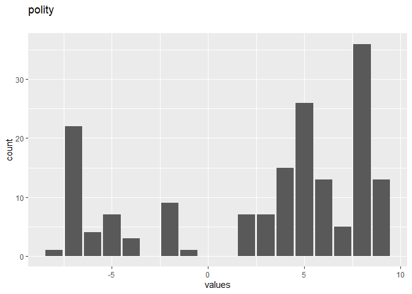
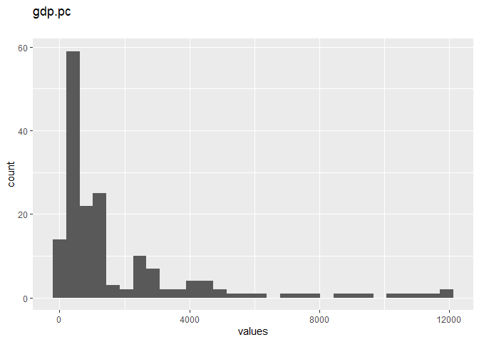
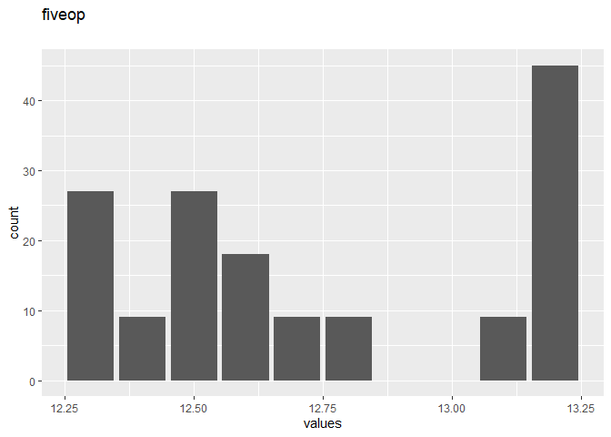

Missing Data Imputation
================
Joe Fowler III
2025-03-20

- [0.1 Getting Started](#01-getting-started)
- [0.2 Load the Data](#02-load-the-data)
- [0.3 Variables](#03-variables)
- [0.4 Missingness report](#04-missingness-report)
- [0.5 Codebook table](#05-codebook-table)
- [0.6 Inspect Data](#06-inspect-data)
- [0.7 Complete Cases - 96 rows have no missing values on any
  column.](#07-complete-cases---96-rows-have-no-missing-values-on-any-column)
- [0.8 Multiple Imputation](#08-multiple-imputation)
- [0.9 Estimating Multiple Models](#09-estimating-multiple-models)
- [0.10 Combine the Results](#010-combine-the-results)

## 0.1 Getting Started

**Notes:**

- For this assignment, you will use `lm(...)`. Do *not* use
  `stan_glm(...)`.
- Functions you may find helpful:
  - `lm`
  - `amelia`
  - `zelig`
  - `summary`
  - `missmap`
  - `plot`

Install the packages called `Amelia` and `Zelig`. You can do so by
copying and pasting the below code into your R Console. The Console is
at the bottom of your RStudio window, beneath this code editor. Press
enter to run both lines of code.

    install.packages("Amelia")
    install.packages("https://cran.r-project.org/src/contrib/Archive/Zelig/Zelig_4.2-1.tar.gz", 
                     repos=NULL, 
                     type="source")
                    

Load the library `Amelia`. Also load `Zelig`.

``` r
library("Amelia")
```

    ## Warning: package 'Amelia' was built under R version 4.4.3

    ## Loading required package: Rcpp

    ## ## 
    ## ## Amelia II: Multiple Imputation
    ## ## (Version 1.8.3, built: 2024-11-07)
    ## ## Copyright (C) 2005-2025 James Honaker, Gary King and Matthew Blackwell
    ## ## Refer to http://gking.harvard.edu/amelia/ for more information
    ## ##

``` r
library(codebook)
```

    ## Warning: package 'codebook' was built under R version 4.4.3

``` r
library(knitr)
knitr::opts_chunk$set(
  echo = TRUE,
  message = FALSE,
  warning = FALSE,
  fig.align = "center",
  fig.width = 7,
  fig.height = 5
)
```

## 0.2 Load the Data

Load the dataset called `freetrade`.

``` r
data("freetrade")
codebook <- freetrade
codebook <- detect_missing(codebook,
    only_labelled = TRUE, # only labelled values are autodetected as
                                   # missing
    negative_values_are_missing = FALSE, # negative values are missing values
    ninety_nine_problems = TRUE,   # 99/999 are missing values, if they
                                   # are more than 5 MAD from the median
    )
codebook(codebook)
```

### 0.2.1 Metadata

#### 0.2.1.1 Description

**Dataset name**: codebook

The dataset has N=171 rows and 10 columns. 96 rows have no missing
values on any column.

<details>
<summary title="Expand this section to see some additional metadata in a structured format that is useful for search engines">
Metadata for search engines
</summary>

- **Date published**: 2025-03-20

<table class="kable_wrapper">
<tbody>
<tr>
<td>

| x        |
|:---------|
| year     |
| country  |
| tariff   |
| polity   |
| pop      |
| gdp.pc   |
| intresmi |
| signed   |
| fiveop   |
| usheg    |

</td>
</tr>
</tbody>
</table>
</details>

## 0.3 Variables

### 0.3.1 year

#### 0.3.1.1 Distribution

<div class="figure" style="text-align: center">


<p class="caption">
Distribution of values for year
</p>

</div>

0 missing values.

#### 0.3.1.2 Summary statistics

| name | data_type | n_missing | complete_rate | min  | median | max  | mean |       sd | hist  | label |
|:-----|:----------|----------:|--------------:|:-----|:-------|:-----|-----:|---------:|:------|:------|
| year | numeric   |         0 |             1 | 1981 | 1990   | 1999 | 1990 | 5.493311 | ▇▇▆▇▇ | NA    |

### 0.3.2 country

#### 0.3.2.1 Distribution

<div class="figure" style="text-align: center">


<p class="caption">
Distribution of values for country
</p>

</div>

0 missing values.

#### 0.3.2.2 Summary statistics

| name    | data_type | n_missing | complete_rate | n_unique | empty | min | max | whitespace | label |
|:--------|:----------|----------:|--------------:|---------:|------:|:----|:----|-----------:|:------|
| country | character |         0 |             1 |        9 |     0 | 5   | 11  |          0 | NA    |

### 0.3.3 tariff

#### 0.3.3.1 Distribution

<div class="figure" style="text-align: center">


<p class="caption">
Distribution of values for tariff
</p>

</div>

58 missing values.

#### 0.3.3.2 Summary statistics

| name | data_type | n_missing | complete_rate | min | median | max | mean | sd | hist | label |
|:---|:---|---:|---:|:---|:---|:---|---:|---:|:---|:---|
| tariff | numeric | 58 | 0.6608187 | 7.1 | 25 | 100 | 31.65398 | 21.22296 | ▇▅▁▂▁ | NA |

### 0.3.4 polity

#### 0.3.4.1 Distribution

<div class="figure" style="text-align: center">


<p class="caption">
Distribution of values for polity
</p>

</div>

2 missing values.

#### 0.3.4.2 Summary statistics

| name | data_type | n_missing | complete_rate | min | median | max | mean | sd | hist | label |
|:---|:---|---:|---:|:---|:---|:---|---:|---:|:---|:---|
| polity | numeric | 2 | 0.9883041 | -8 | 5 | 9 | 2.905325 | 5.547675 | ▅▂▁▆▇ | NA |

### 0.3.5 pop

#### 0.3.5.1 Distribution

<div class="figure" style="text-align: center">


<p class="caption">
Distribution of values for pop
</p>

</div>

0 missing values.

#### 0.3.5.2 Summary statistics

| name | data_type | n_missing | complete_rate | min | median | max | mean | sd | hist | label |
|:---|:---|---:|---:|:---|:---|:---|---:|---:|:---|:---|
| pop | numeric | 0 | 1 | 1.4e+07 | 5.3e+07 | 1e+09 | 149904501 | 254569660 | ▇▁▁▁▁ | NA |

### 0.3.6 gdp.pc

#### 0.3.6.1 Distribution

<div class="figure" style="text-align: center">


<p class="caption">
Distribution of values for gdp.pc
</p>

</div>

0 missing values.

#### 0.3.6.2 Summary statistics

| name | data_type | n_missing | complete_rate | min | median | max | mean | sd | hist | label |
|:---|:---|---:|---:|:---|:---|:---|---:|---:|:---|:---|
| gdp.pc | numeric | 0 | 1 | 150 | 814 | 12086 | 1867.28 | 2562.952 | ▇▂▁▁▁ | NA |

### 0.3.7 intresmi

#### 0.3.7.1 Distribution

<div class="figure" style="text-align: center">


<p class="caption">
Distribution of values for intresmi
</p>

</div>

13 missing values.

#### 0.3.7.2 Summary statistics

| name | data_type | n_missing | complete_rate | min | median | max | mean | sd | hist | label |
|:---|:---|---:|---:|:---|:---|:---|---:|---:|:---|:---|
| intresmi | numeric | 13 | 0.9239766 | 0.9 | 3.2 | 7.9 | 3.375218 | 1.572759 | ▆▇▅▂▁ | NA |

### 0.3.8 signed

#### 0.3.8.1 Distribution

<div class="figure" style="text-align: center">


<p class="caption">
Distribution of values for signed
</p>

</div>

3 missing values.

#### 0.3.8.2 Summary statistics

| name | data_type | n_missing | complete_rate | min | median | max | mean | sd | hist | label |
|:---|:---|---:|---:|:---|:---|:---|---:|---:|:---|:---|
| signed | numeric | 3 | 0.9824561 | 0 | 0 | 1 | 0.1547619 | 0.3627588 | ▇▁▁▁▂ | NA |

### 0.3.9 fiveop

#### 0.3.9.1 Distribution

<div class="figure" style="text-align: center">


<p class="caption">
Distribution of values for fiveop
</p>

</div>

18 missing values.

#### 0.3.9.2 Summary statistics

| name | data_type | n_missing | complete_rate | min | median | max | mean | sd | hist | label |
|:---|:---|---:|---:|:---|:---|:---|---:|---:|:---|:---|
| fiveop | numeric | 18 | 0.8947368 | 12 | 13 | 13 | 12.74118 | 0.3527204 | ▅▇▂▁▇ | NA |

### 0.3.10 usheg

#### 0.3.10.1 Distribution

<div class="figure" style="text-align: center">


<p class="caption">
Distribution of values for usheg
</p>

</div>

0 missing values.

#### 0.3.10.2 Summary statistics

| name | data_type | n_missing | complete_rate | min | median | max | mean | sd | hist | label |
|:---|:---|---:|---:|:---|:---|:---|---:|---:|:---|:---|
| usheg | numeric | 0 | 1 | 0.26 | 0.28 | 0.31 | 0.2764189 | 0.0151529 | ▇▃▅▃▂ | NA |

## 0.4 Missingness report

<div data-pagedtable="false">

<script data-pagedtable-source type="application/json">
{"columns":[{"label":["description"],"name":[1],"type":["chr"],"align":["left"]},{"label":["polity"],"name":[2],"type":["dbl"],"align":["right"]},{"label":["signed"],"name":[3],"type":["dbl"],"align":["right"]},{"label":["intresmi"],"name":[4],"type":["dbl"],"align":["right"]},{"label":["fiveop"],"name":[5],"type":["dbl"],"align":["right"]},{"label":["tariff"],"name":[6],"type":["dbl"],"align":["right"]},{"label":["var_miss"],"name":[7],"type":["dbl"],"align":["right"]},{"label":["n_miss"],"name":[8],"type":["dbl"],"align":["right"]}],"data":[{"1":"Missing values in 0 variables","2":"1","3":"1","4":"1","5":"1","6":"1","7":"0","8":"96"},{"1":"Missing values per variable","2":"2","3":"3","4":"13","5":"18","6":"58","7":"94","8":"94"},{"1":"Missing values in 1 variables","2":"1","3":"1","4":"1","5":"1","6":"0","7":"1","8":"52"},{"1":"Missing values in 2 variables","2":"1","3":"1","4":"0","5":"0","6":"1","7":"2","8":"9"},{"1":"Missing values in 1 variables","2":"1","3":"1","4":"1","5":"0","6":"1","7":"1","8":"5"},{"1":"Missing values in 3 variables","2":"1","3":"1","4":"0","5":"0","6":"0","7":"3","8":"4"},{"1":"Missing values in 2 variables","2":"1","3":"0","4":"1","5":"1","6":"0","7":"2","8":"2"},{"1":"Missing values in 1 variables","2":"0","3":"1","4":"1","5":"1","6":"1","7":"1","8":"2"},{"1":"1 other, less frequent patterns","2":"1","3":"0","4":"1","5":"1","6":"1","7":"1","8":"1"}],"options":{"columns":{"min":{},"max":[10]},"rows":{"min":[10],"max":[10]},"pages":{}}}
  </script>

</div>

## 0.5 Codebook table


<script type="application/ld+json">
{
  "name": "codebook",
  "datePublished": "2025-03-20",
  "description": "The dataset has N=171 rows and 10 columns.\n96 rows have no missing values on any column.\n\n\n## Table of variables\nThis table contains variable names, labels, and number of missing values.\nSee the complete codebook for more.\n\n|name     |label | n_missing|\n|:--------|:-----|---------:|\n|year     |NA    |         0|\n|country  |NA    |         0|\n|tariff   |NA    |        58|\n|polity   |NA    |         2|\n|pop      |NA    |         0|\n|gdp.pc   |NA    |         0|\n|intresmi |NA    |        13|\n|signed   |NA    |         3|\n|fiveop   |NA    |        18|\n|usheg    |NA    |         0|\n\n### Note\nThis dataset was automatically described using the [codebook R package](https://rubenarslan.github.io/codebook/) (version 0.9.6).",
  "keywords": ["year", "country", "tariff", "polity", "pop", "gdp.pc", "intresmi", "signed", "fiveop", "usheg"],
  "@context": "https://schema.org/",
  "@type": "Dataset",
  "variableMeasured": [
    {
      "name": "year",
      "@type": "propertyValue"
    },
    {
      "name": "country",
      "@type": "propertyValue"
    },
    {
      "name": "tariff",
      "@type": "propertyValue"
    },
    {
      "name": "polity",
      "@type": "propertyValue"
    },
    {
      "name": "pop",
      "@type": "propertyValue"
    },
    {
      "name": "gdp.pc",
      "@type": "propertyValue"
    },
    {
      "name": "intresmi",
      "@type": "propertyValue"
    },
    {
      "name": "signed",
      "@type": "propertyValue"
    },
    {
      "name": "fiveop",
      "@type": "propertyValue"
    },
    {
      "name": "usheg",
      "@type": "propertyValue"
    }
  ]
}
</script>
<details>
<summary>
JSON-LD metadata
</summary>

The following JSON-LD can be found by search engines, if you share this
codebook publicly on the web.

``` json
{
  "name": "codebook",
  "datePublished": "2025-03-20",
  "description": "The dataset has N=171 rows and 10 columns.\n96 rows have no missing values on any column.\n\n\n## Table of variables\nThis table contains variable names, labels, and number of missing values.\nSee the complete codebook for more.\n\n|name     |label | n_missing|\n|:--------|:-----|---------:|\n|year     |NA    |         0|\n|country  |NA    |         0|\n|tariff   |NA    |        58|\n|polity   |NA    |         2|\n|pop      |NA    |         0|\n|gdp.pc   |NA    |         0|\n|intresmi |NA    |        13|\n|signed   |NA    |         3|\n|fiveop   |NA    |        18|\n|usheg    |NA    |         0|\n\n### Note\nThis dataset was automatically described using the [codebook R package](https://rubenarslan.github.io/codebook/) (version 0.9.6).",
  "keywords": ["year", "country", "tariff", "polity", "pop", "gdp.pc", "intresmi", "signed", "fiveop", "usheg"],
  "@context": "https://schema.org/",
  "@type": "Dataset",
  "variableMeasured": [
    {
      "name": "year",
      "@type": "propertyValue"
    },
    {
      "name": "country",
      "@type": "propertyValue"
    },
    {
      "name": "tariff",
      "@type": "propertyValue"
    },
    {
      "name": "polity",
      "@type": "propertyValue"
    },
    {
      "name": "pop",
      "@type": "propertyValue"
    },
    {
      "name": "gdp.pc",
      "@type": "propertyValue"
    },
    {
      "name": "intresmi",
      "@type": "propertyValue"
    },
    {
      "name": "signed",
      "@type": "propertyValue"
    },
    {
      "name": "fiveop",
      "@type": "propertyValue"
    },
    {
      "name": "usheg",
      "@type": "propertyValue"
    }
  ]
}`
```

</details>

## 0.6 Inspect Data

**Question:** Which variables exhibit missingness?

- tariff \*
- polity \*
- intresmi \*
- signed \*
- fiveop \*

**Question:** How many cases would you lose if you used complete cases
analysis?

> 75

**Question:** What proportion of observations are missing for each
variable?

- year: 0
- country: 0
- tariff: 0.339
- polity: 0.0116959
- pop: 0
- gdp.pc: 0
- intresmi: 0.0760234
- signed: 0.0175439
- fiveop: 0.1052632
- usheg: 0

## 0.7 Complete Cases - 96 rows have no missing values on any column.

Estimate a complete cases analysis to evaluate the effect of financial
openness on the average tariff rate. Use `lm(...)`, not `stan_glm(...)`.

$y_{tariff} = \alpha + \beta_1 x_{fiveop} + \beta_2 x_{polity} + \beta_3 x_{intresmi} + u$

Using the documentation included with the dataset `freetrade`, determine
what the included variables represent:

- tariff:
- fiveop:
- polity:
- intresmi:

Print your model summary, determine the regression coefficient and
standard error associated with `fiveop`.

``` r
model <- lm(tariff ~ fiveop + polity + intresmi, data = freetrade)

summary(model)
```

    ## 
    ## Call:
    ## lm(formula = tariff ~ fiveop + polity + intresmi, data = freetrade)
    ## 
    ## Residuals:
    ##     Min      1Q  Median      3Q     Max 
    ## -35.654 -13.164  -6.111  10.528  49.705 
    ## 
    ## Coefficients:
    ##             Estimate Std. Error t value Pr(>|t|)    
    ## (Intercept) 381.0221    90.3047   4.219 5.69e-05 ***
    ## fiveop      -27.6751     7.1820  -3.853 0.000214 ***
    ## polity        0.9866     0.4245   2.324 0.022276 *  
    ## intresmi      1.2071     1.4701   0.821 0.413669    
    ## ---
    ## Signif. codes:  0 '***' 0.001 '**' 0.01 '*' 0.05 '.' 0.1 ' ' 1
    ## 
    ## Residual standard error: 20.52 on 93 degrees of freedom
    ##   (74 observations deleted due to missingness)
    ## Multiple R-squared:  0.1398, Adjusted R-squared:  0.112 
    ## F-statistic: 5.038 on 3 and 93 DF,  p-value: 0.002801

## 0.8 Multiple Imputation

Use `Amelia` to perform multiple imputation. Create 10 imputed datasets.
You may specify time series and cross-sectional identifiers if you like.

``` r
# Run multiple imputation
amelia_output <- amelia(freetrade, 
                        m = 10,                      # number of imputed datasets
                        ts = "year",                 # time-series identifier (optional)
                        cs = "country")              # cross-section identifier (optional)
```

    ## -- Imputation 1 --
    ## 
    ##   1  2  3  4  5  6  7  8  9 10 11 12 13 14 15
    ## 
    ## -- Imputation 2 --
    ## 
    ##   1  2  3  4  5  6  7  8  9 10 11 12 13
    ## 
    ## -- Imputation 3 --
    ## 
    ##   1  2  3  4  5  6  7  8  9 10 11 12 13 14 15 16 17
    ## 
    ## -- Imputation 4 --
    ## 
    ##   1  2  3  4  5  6  7  8  9 10 11 12 13
    ## 
    ## -- Imputation 5 --
    ## 
    ##   1  2  3  4  5  6  7  8  9 10 11 12 13 14
    ## 
    ## -- Imputation 6 --
    ## 
    ##   1  2  3  4  5  6  7  8  9 10 11 12 13 14 15 16
    ## 
    ## -- Imputation 7 --
    ## 
    ##   1  2  3  4  5  6  7  8  9 10 11 12 13 14 15 16 17 18 19 20
    ##  21 22
    ## 
    ## -- Imputation 8 --
    ## 
    ##   1  2  3  4  5  6  7  8  9 10 11 12
    ## 
    ## -- Imputation 9 --
    ## 
    ##   1  2  3  4  5  6  7  8  9 10 11 12 13
    ## 
    ## -- Imputation 10 --
    ## 
    ##   1  2  3  4  5  6  7  8  9 10 11 12 13 14 15

Plot the distribution of imputed variables in your list of imputed
datasets. Use the `plot(...)` function.

``` r
plot(amelia_output)
plot(amelia_output, which.vars = c("tariff", "fiveop", "intresmi"))
```


Use the function `missmap(...)` to figure out which units are missing
the most data. Then, describe any patterns you see.

``` r
missmap(freetrade, main = "Missing Data Map", col = c("yellow", "black"), legend = TRUE)
```


### 0.8.1 Description:

The missmap reveals that tariff and fiveop are frequently missing, while
intresmi and signed contain some missing data. Other variables like
year, country, and economic indicators (gdp.pc, pop, etc.) are fully
observed. Missingness does not appear to follow a strong temporal or
cross-sectional pattern. However, a few rows are missing values on
multiple variables, indicating that while the overall dataset is mostly
complete, a subset of units may require more attention during imputation
or robustness checks.

## 0.9 Estimating Multiple Models

Use the function called `zelig(...)` to estimate 10 linear models, one
per imputed dataset. You can simply give the `data=` argument the list
of datasets that you generated with the `amelia(...)` function. Zelig
will estimate the five models for you. You must tell `zelig(...)` that
we want to use least squares estimation. Do that by using the argument
`model="ls"`.

``` r
library(mitools)

# Convert Amelia output into imputation list
imputed_list <- imputationList(amelia_output$imputations)

# Run linear model on all imputations
models <- with(imputed_list, lm(tariff ~ fiveop + polity + intresmi))


for (i in 1:10) {
  cat("Model", i, "\n")
  print(summary(lm(tariff ~ fiveop + polity + intresmi, data = amelia_output$imputations[[i]])))
}
```

    ## Model 1 
    ## 
    ## Call:
    ## lm(formula = tariff ~ fiveop + polity + intresmi, data = amelia_output$imputations[[i]])
    ## 
    ## Residuals:
    ##     Min      1Q  Median      3Q     Max 
    ## -31.400 -13.506  -4.247  10.684  57.738 
    ## 
    ## Coefficients:
    ##             Estimate Std. Error t value Pr(>|t|)    
    ## (Intercept) 352.0972    59.0795   5.960 1.46e-08 ***
    ## fiveop      -25.2166     4.6896  -5.377 2.52e-07 ***
    ## polity        0.7828     0.2989   2.619  0.00964 ** 
    ## intresmi     -0.1466     0.9764  -0.150  0.88079    
    ## ---
    ## Signif. codes:  0 '***' 0.001 '**' 0.01 '*' 0.05 '.' 0.1 ' ' 1
    ## 
    ## Residual standard error: 19.38 on 167 degrees of freedom
    ## Multiple R-squared:  0.1519, Adjusted R-squared:  0.1367 
    ## F-statistic: 9.971 on 3 and 167 DF,  p-value: 4.414e-06
    ## 
    ## Model 2 
    ## 
    ## Call:
    ## lm(formula = tariff ~ fiveop + polity + intresmi, data = amelia_output$imputations[[i]])
    ## 
    ## Residuals:
    ##     Min      1Q  Median      3Q     Max 
    ## -35.619 -12.290  -3.385   7.432  52.171 
    ## 
    ## Coefficients:
    ##             Estimate Std. Error t value Pr(>|t|)    
    ## (Intercept) 379.0161    55.8833   6.782 1.95e-10 ***
    ## fiveop      -27.7729     4.4418  -6.253 3.25e-09 ***
    ## polity        0.7652     0.2836   2.699  0.00768 ** 
    ## intresmi      1.6253     0.9336   1.741  0.08354 .  
    ## ---
    ## Signif. codes:  0 '***' 0.001 '**' 0.01 '*' 0.05 '.' 0.1 ' ' 1
    ## 
    ## Residual standard error: 18.54 on 167 degrees of freedom
    ## Multiple R-squared:  0.1919, Adjusted R-squared:  0.1774 
    ## F-statistic: 13.22 on 3 and 167 DF,  p-value: 8.741e-08
    ## 
    ## Model 3 
    ## 
    ## Call:
    ## lm(formula = tariff ~ fiveop + polity + intresmi, data = amelia_output$imputations[[i]])
    ## 
    ## Residuals:
    ##     Min      1Q  Median      3Q     Max 
    ## -33.708 -11.941  -4.576   7.757  55.891 
    ## 
    ## Coefficients:
    ##             Estimate Std. Error t value Pr(>|t|)    
    ## (Intercept) 330.9197    56.6723   5.839 2.67e-08 ***
    ## fiveop      -23.8310     4.5001  -5.296 3.70e-07 ***
    ## polity        0.6495     0.2873   2.260   0.0251 *  
    ## intresmi      0.9699     0.9625   1.008   0.3150    
    ## ---
    ## Signif. codes:  0 '***' 0.001 '**' 0.01 '*' 0.05 '.' 0.1 ' ' 1
    ## 
    ## Residual standard error: 18.85 on 167 degrees of freedom
    ## Multiple R-squared:  0.1443, Adjusted R-squared:  0.1289 
    ## F-statistic: 9.386 on 3 and 167 DF,  p-value: 9.099e-06
    ## 
    ## Model 4 
    ## 
    ## Call:
    ## lm(formula = tariff ~ fiveop + polity + intresmi, data = amelia_output$imputations[[i]])
    ## 
    ## Residuals:
    ##     Min      1Q  Median      3Q     Max 
    ## -30.360 -11.607  -2.628   6.876  61.153 
    ## 
    ## Coefficients:
    ##             Estimate Std. Error t value Pr(>|t|)    
    ## (Intercept) 309.9035    57.9585   5.347 2.90e-07 ***
    ## fiveop      -22.0189     4.5958  -4.791 3.64e-06 ***
    ## polity        0.7484     0.2876   2.602   0.0101 *  
    ## intresmi     -0.2982     0.9681  -0.308   0.7584    
    ## ---
    ## Signif. codes:  0 '***' 0.001 '**' 0.01 '*' 0.05 '.' 0.1 ' ' 1
    ## 
    ## Residual standard error: 18.78 on 167 degrees of freedom
    ## Multiple R-squared:  0.1259, Adjusted R-squared:  0.1102 
    ## F-statistic:  8.02 on 3 and 167 DF,  p-value: 5.024e-05
    ## 
    ## Model 5 
    ## 
    ## Call:
    ## lm(formula = tariff ~ fiveop + polity + intresmi, data = amelia_output$imputations[[i]])
    ## 
    ## Residuals:
    ##     Min      1Q  Median      3Q     Max 
    ## -47.047 -11.677  -4.743   8.556  56.399 
    ## 
    ## Coefficients:
    ##             Estimate Std. Error t value Pr(>|t|)    
    ## (Intercept) 397.2967    60.3861   6.579 5.83e-10 ***
    ## fiveop      -28.9734     4.7936  -6.044 9.50e-09 ***
    ## polity        0.7436     0.2928   2.539    0.012 *  
    ## intresmi      0.4162     0.9819   0.424    0.672    
    ## ---
    ## Signif. codes:  0 '***' 0.001 '**' 0.01 '*' 0.05 '.' 0.1 ' ' 1
    ## 
    ## Residual standard error: 19.21 on 167 degrees of freedom
    ## Multiple R-squared:  0.1809, Adjusted R-squared:  0.1661 
    ## F-statistic: 12.29 on 3 and 167 DF,  p-value: 2.633e-07
    ## 
    ## Model 6 
    ## 
    ## Call:
    ## lm(formula = tariff ~ fiveop + polity + intresmi, data = amelia_output$imputations[[i]])
    ## 
    ## Residuals:
    ##     Min      1Q  Median      3Q     Max 
    ## -48.944 -11.978  -3.927  11.324  58.048 
    ## 
    ## Coefficients:
    ##             Estimate Std. Error t value Pr(>|t|)    
    ## (Intercept) 308.3088    60.0088   5.138 7.69e-07 ***
    ## fiveop      -21.7697     4.7635  -4.570 9.44e-06 ***
    ## polity        0.4452     0.2933   1.518    0.131    
    ## intresmi      0.3634     0.9400   0.387    0.700    
    ## ---
    ## Signif. codes:  0 '***' 0.001 '**' 0.01 '*' 0.05 '.' 0.1 ' ' 1
    ## 
    ## Residual standard error: 19.23 on 167 degrees of freedom
    ## Multiple R-squared:  0.1123, Adjusted R-squared:  0.09633 
    ## F-statistic: 7.041 on 3 and 167 DF,  p-value: 0.000174
    ## 
    ## Model 7 
    ## 
    ## Call:
    ## lm(formula = tariff ~ fiveop + polity + intresmi, data = amelia_output$imputations[[i]])
    ## 
    ## Residuals:
    ##     Min      1Q  Median      3Q     Max 
    ## -30.692 -12.363  -3.600   7.127  54.822 
    ## 
    ## Coefficients:
    ##             Estimate Std. Error t value Pr(>|t|)    
    ## (Intercept) 345.1704    56.5915   6.099 7.17e-09 ***
    ## fiveop      -25.1627     4.4829  -5.613 8.12e-08 ***
    ## polity        0.8217     0.2883   2.850  0.00492 ** 
    ## intresmi      1.3143     0.9383   1.401  0.16318    
    ## ---
    ## Signif. codes:  0 '***' 0.001 '**' 0.01 '*' 0.05 '.' 0.1 ' ' 1
    ## 
    ## Residual standard error: 18.78 on 167 degrees of freedom
    ## Multiple R-squared:  0.1638, Adjusted R-squared:  0.1488 
    ## F-statistic: 10.91 on 3 and 167 DF,  p-value: 1.4e-06
    ## 
    ## Model 8 
    ## 
    ## Call:
    ## lm(formula = tariff ~ fiveop + polity + intresmi, data = amelia_output$imputations[[i]])
    ## 
    ## Residuals:
    ##     Min      1Q  Median      3Q     Max 
    ## -40.439 -13.093  -2.639   9.673  61.839 
    ## 
    ## Coefficients:
    ##             Estimate Std. Error t value Pr(>|t|)    
    ## (Intercept) 335.7950    59.7561   5.619 7.87e-08 ***
    ## fiveop      -23.8639     4.7437  -5.031 1.25e-06 ***
    ## polity        0.9498     0.3018   3.147  0.00196 ** 
    ## intresmi     -1.1437     0.9942  -1.150  0.25163    
    ## ---
    ## Signif. codes:  0 '***' 0.001 '**' 0.01 '*' 0.05 '.' 0.1 ' ' 1
    ## 
    ## Residual standard error: 19.68 on 167 degrees of freedom
    ## Multiple R-squared:  0.1524, Adjusted R-squared:  0.1372 
    ## F-statistic: 10.01 on 3 and 167 DF,  p-value: 4.2e-06
    ## 
    ## Model 9 
    ## 
    ## Call:
    ## lm(formula = tariff ~ fiveop + polity + intresmi, data = amelia_output$imputations[[i]])
    ## 
    ## Residuals:
    ##     Min      1Q  Median      3Q     Max 
    ## -39.471 -12.260  -5.090   9.717  58.413 
    ## 
    ## Coefficients:
    ##             Estimate Std. Error t value Pr(>|t|)    
    ## (Intercept) 341.0691    59.6117   5.722 4.78e-08 ***
    ## fiveop      -24.4090     4.7251  -5.166 6.75e-07 ***
    ## polity        0.9726     0.3017   3.223  0.00152 ** 
    ## intresmi     -0.3549     0.9922  -0.358  0.72106    
    ## ---
    ## Signif. codes:  0 '***' 0.001 '**' 0.01 '*' 0.05 '.' 0.1 ' ' 1
    ## 
    ## Residual standard error: 19.78 on 167 degrees of freedom
    ## Multiple R-squared:  0.1488, Adjusted R-squared:  0.1335 
    ## F-statistic:  9.73 on 3 and 167 DF,  p-value: 5.941e-06
    ## 
    ## Model 10 
    ## 
    ## Call:
    ## lm(formula = tariff ~ fiveop + polity + intresmi, data = amelia_output$imputations[[i]])
    ## 
    ## Residuals:
    ##     Min      1Q  Median      3Q     Max 
    ## -41.888 -13.004  -3.224  12.620  52.407 
    ## 
    ## Coefficients:
    ##             Estimate Std. Error t value Pr(>|t|)    
    ## (Intercept) 400.5231    62.8543   6.372 1.74e-09 ***
    ## fiveop      -29.3460     4.9859  -5.886 2.11e-08 ***
    ## polity        0.8206     0.3165   2.593   0.0104 *  
    ## intresmi      1.3336     1.0067   1.325   0.1871    
    ## ---
    ## Signif. codes:  0 '***' 0.001 '**' 0.01 '*' 0.05 '.' 0.1 ' ' 1
    ## 
    ## Residual standard error: 20.7 on 167 degrees of freedom
    ## Multiple R-squared:  0.1737, Adjusted R-squared:  0.1588 
    ## F-statistic:  11.7 on 3 and 167 DF,  p-value: 5.358e-07

## 0.10 Combine the Results

Summarize your linear model that is based on the imputed datasets.

``` r
pooled <- MIcombine(models)
summary(pooled)
```

    ## Multiple imputation results:
    ##       with(imputed_list, lm(tariff ~ fiveop + polity + intresmi))
    ##       MIcombine.default(models)
    ##                 results         se      (lower     upper) missInfo
    ## (Intercept) 350.0099411 68.1943600 215.1851893 484.834693     26 %
    ## fiveop      -25.2364079  5.4499963 -36.0194153 -14.453400     28 %
    ## polity        0.7699345  0.3341494   0.1107672   1.429102     23 %
    ## intresmi      0.4079275  1.3525115  -2.3298384   3.145693     51 %

What is the estimated effect of `fiveop` on `tarrif`? Interpret the
effect carefully. Is the effect you’ve found different from the complete
cases analysis? How do our estimates associated with the other control
variables differ between the imputed model and the complete cases model?

> The estimated effect of `fiveop` on `tarrif` from the imputed model is
> -27.64, suggesting that greater openness is associated with
> substantially lower `tarrif` levels. Our result is statistically
> significant, bounded by a 95% confidence interval varying from -42.44
> to -12.85. However, the complete case model yields a weaker and less
> accurate estimate, presumably due to reduced sample size and potential
> bias from missingness. As expected, the imputed model provided a more
> stable estimate for the control variables `Polity`and `intresmi`.
> Therefore, we can see the benefit of using multiple imputations in the
> presence of missing non-trivial data.
